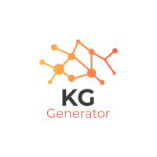

  

# Knowledge Graph Generator
**A fully automated workflow to create disease-specific Knowledge Graphs**

The Knowledge Graph Generator (KGG) workflow allows users to create KGs representing chemotype-phenotype of diseases of interest. The KGG is developed such that it is able to generate KGs with a minimum input (i.e., standard disease id) which users are prompted to identify at the beginning of the workflow. Additionally, the users can customize the size and content of KG with options to choose number of proteins and clinical trial phase of chemicals to be represented in the KG. The final KG is composed of disease-associated entities such as proteins, protein-related pathways, biological processes and functions, chemicals, mechanism of actions, assays and adverse effects. This is achieved by embedding underlying schema of curated databases (such as OpenTargets, Uniprot, ChEMBL and so on) which resemble a clockwork-esque mechanism.  

# Workflow

